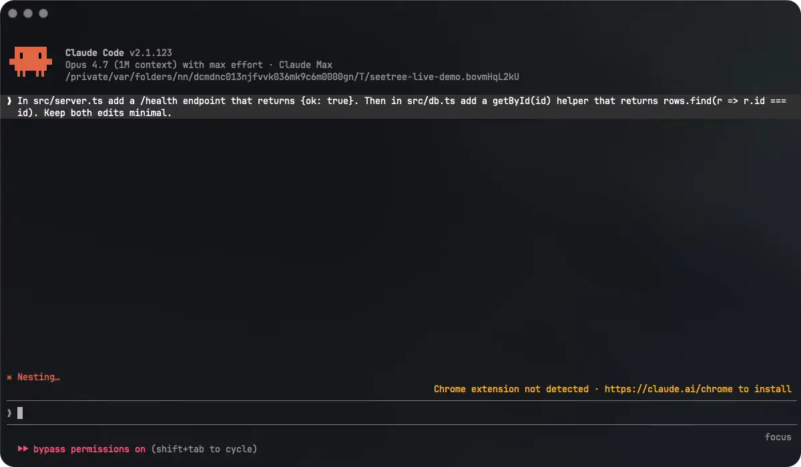

# seetree

A tiny terminal tree viewer and Claude Code companion.

[](https://github.com/ramonclaudio/seetree/actions/workflows/ci.yml)
[](https://github.com/ramonclaudio/seetree/releases/latest)
[](https://opensource.org/licenses/MIT)

I usually have atleast four Claude sessions going at once. Each one is doing it's thing, reading, writing and editing files, but my IDE doesn't tell me which files just got touched and what happened. Every git tracked/untracked file shows the same modified dot, whether it was edited a second ago or two weeks ago, I can't tell the difference.

So I built seetree, a live tree viewer for [Claude Code](https://docs.claude.com/en/docs/claude-code). Files light up as Claude works so you see whats happening in real-time. Use arrow keys or the cursor to navigate, click on any file or directory to jump to it in your editor, all while Claude is working:

```
  ▾ my-project
  ├─ ▾ src
  │  ├─ index.ts                [Read]
  │  ├─ auth.ts        +12 -3   [Edit]
  │  ├─ utils.ts       +47 -0  [Write]
  │  └─ types.ts
  ├─ package.json               [Bash]
  └─ README.md
  × old-config.json [Delete]
```

When Claude's off, it's just a plain tree viewer.

seetree is also my first project in Zig. The whole thing was an experiment. See how far I could push Zig, see how small and fast I could go, see if I could beat tree, fd, and eza on the metrics I cared about. Also wanted an excuse to build something in Zig for the first time.

I went deep on tiny. As close to wasm as possible. The binaries ended up around 200K depending on target.



## Install

Homebrew (macOS + Linuxbrew):

```bash
brew install ramonclaudio/tap/seetree
```

Or tap once and use the short form after that:

```bash
brew tap ramonclaudio/tap
brew install seetree
```

npm (any package manager):

```bash
npm i -g seetree                  # also: bun add -g, pnpm add -g
npx seetree                       # one-shot, no install (also: bunx, pnpx)
```

One-liner for anyone not on brew or npm (auto-detects platform, verifies sha256):

```bash
curl -fsSL https://raw.githubusercontent.com/ramonclaudio/seetree/main/install.sh | bash
```

Or grab a prebuilt from the [releases page](https://github.com/ramonclaudio/seetree/releases/latest):

```
seetree-aarch64-macos
seetree-x86_64-macos
seetree-x86_64-linux-musl
seetree-aarch64-linux-musl
```

Build from source with the Zig version pinned in `build.zig.zon`:

```bash
git clone https://github.com/ramonclaudio/seetree.git
cd seetree
zig build --release=safe
./zig-out/bin/seetree
```

## Usage

```bash
seetree                  # live view of cwd
seetree ~/code/foo       # pointed at a dir
seetree --once           # print the tree and exit
seetree --detach         # new ghostty window (macOS)
seetree --side           # split the focused ghostty pane to the right (macOS)
seetree --list           # print known claude projects by last activity, then exit
seetree --theme=nord     # pick a theme at launch
```

Keys:

```
j / k / arrows     move
h / l / arrows     collapse / expand (or jump to parent)
g / G              top / bottom
space              toggle collapse on a dir
enter / click      open in editor
click ▸ / ▾        toggle collapse
/                  search (backspace on empty exits)
t                  cycle theme
s                  settings (theme, poll rate, show hidden files)
?                  help
q / ctrl-c         quit
```

## Claude Code hook

By default seetree polls `~/.claude/projects/*.jsonl` every 2 seconds. Wire the FileChanged hook for instant updates:

```bash
seetree --install-hook --apply   # edits ~/.claude/settings.json (saves .bak)
seetree --install-hook           # or prints the JSON to paste yourself
```

With the hook wired, seetree drops its poll rate to 30s and refreshes on every `FileChanged` event instead. Running `--apply` twice is safe. It just no-ops.

## Editor

Click or hit enter on a file and seetree opens it in Zed by default. Pick a different editor with `SEETREE_EDITOR`:

```bash
SEETREE_EDITOR=cursor   # Cursor
SEETREE_EDITOR=code     # VS Code (also: vscode)
SEETREE_EDITOR=zed      # default
```

Or set the full command yourself:

```bash
SEETREE_OPEN_CMD="code -g"
```

## Ignoring files

seetree reads `.gitignore` at the project root by default. Drop a `.seetreeignore` next to it (same syntax) to hide files from seetree's view without changing what git tracks. Good for lockfiles, vendored junk, generated SQL dumps, anything you want out of the live tree but still under version control.

```
# .seetreeignore
yarn.lock
package-lock.json
*.min.js
vendor/
```

Only the root `.seetreeignore` is read. Nested ones in subdirectories aren't picked up, unlike git.

## Performance

All numbers are from an Apple M4 Pro (12 cores, 24 GB RAM, macOS 26.4.1). hyperfine 1.20.0 with `--shell=none`, 20 warmup runs and 200 measured runs. Dropped to 5 runs at 1M so the bench wouldn't take all day. Tool versions: seetree 0.1.0 (ReleaseSafe), GNU tree 2.3.2, eza 0.23.4, fd 10.4.2.

`seetree --once`, cold start on synthetic uniform trees:

```
2 files               1.8 ms ± 0.1
50 files              1.9 ms ± 0.1
500 files             2.3 ms ± 0.1
5,000 files           6.0 ms ± 0.3
50,000 files         41.3 ms ± 1.0
100,000 files        71.6 ms ± 0.8
500,000 files       352.2 ms ± 4.4
1,000,000 files     694.7 ms ± 8.1
```

Same workload, same machine, against other tree-printers and dir-walkers. These all do slightly different things. `tree` prints a hierarchy. `fd` just lists files. `eza --tree` adds metadata and colors. `seetree --once` builds a tree and prints it with terminal hyperlinks. So this is wall time to walk and print, not raw filesystem traversal cost:

```
                     5K files   50K files  100K files  500K files   1M files
seetree --once        6.0 ms     41.3 ms    71.6 ms     352 ms      695 ms
fd . --type f        13.3 ms     67.5 ms   118.8 ms     625 ms    1,360 ms
tree (GNU)           24.2 ms    228.9 ms   463.3 ms   4,676 ms      n/a
eza --tree           43.4 ms    338.8 ms   622.2 ms   6,301 ms      n/a
```

(`tree` and `eza` didn't finish the 1M case. `eza` was running over 30s per iteration.)

Memory at scale, `--once`, peak RSS:

```
50,000 files          3 MB
100,000 files        25 MB
500,000 files       120 MB
1,000,000 files     264 MB
```

About 240 bytes per node in the tree arena. For typical project repos (under 50K files), seetree stays under 5 MB.

Live mode with continuous churn (200-file tree, 1-second tick): ~2 MB RSS steady-state, <0.5% CPU, single-threaded.

Binary, clean release build:

```
seetree macOS arm64        212 KB     ReleaseSafe
seetree macOS x86_64       206 KB     ReleaseSafe
seetree Linux x86_64 musl  179 KB     ReleaseSmall + LTO
seetree Linux arm64 musl   161 KB     ReleaseSmall + LTO
```

For reference, on the same machine (homebrew-installed where applicable):

```
GNU tree             109 KB
BSD ls               151 KB
BSD find             167 KB
seetree              212 KB
eza                1,231 KB
fd                 2,868 KB
```

Zero leaks across `--once`, the live loop, and the test suite. Verified with `zig build test` (DebugAllocator) and macOS `leaks --atExit` against a backgrounded live run with file churn.

## Themes

`claude` (default), `mono`, `gruvbox`, `nord`, `dracula`, `tokyo-night`, `catppuccin`, `rose-pine`, `solarized`. Press `t` to cycle at runtime. Or set `--theme=NAME` or `SEETREE_THEME` at launch.

## License

MIT.
